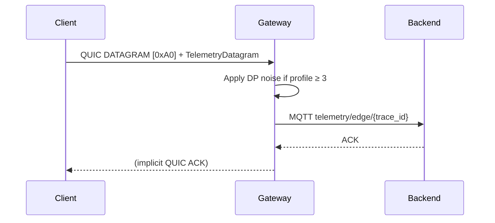

# AXCP v0.3-draft – Adaptive eXchange Context Protocol

© 2025 TradePhantom LLC – BSL 1.1 / Apache-2.0 fallback

_Work in progress – structure auto-generated._

> This document defines the initial AXCP protocol specification.
> Version: **v0.3-draft**
> Status: **Draft**
> Last updated: 2025-05-30

---

## Table of Contents

- [1. Preface](#1-preface)
- [2. Overview](#2-overview)
- [3. Protocol Basics](#3-protocol-basics)
- [4. Message Types](#4-message-types)
- [5. Transport Layer](#5-transport-layer)
- [6. Differential Privacy](#6-differential-privacy)
- [7. Security Considerations](#7-security-considerations)
- [8. Error Handling](#8-error-handling)
- [9. Extensibility](#9-extensibility)
- [Appendix A – Example Flows](#appendix-a-example-flows)
- [Appendix B – Interop Profiles](#appendix-b-interop-profiles)
- [Appendix C – Telemetry Datagram Format](#appendix-c-telemetry-datagram-format)

## 5. Transport Layer

### 5.8 QUIC DATAGRAM Extension

AXCP extends QUIC with a DATAGRAM frame for low-latency telemetry data. This is particularly useful for real-time monitoring and metrics collection in edge computing scenarios.

#### 5.8.1 Telemetry Datagram Format

A QUIC DATAGRAM with first byte `0xA0` MUST carry a `TelemetryDatagram` protobuf message:

```protobuf
message TelemetryDatagram {
  // Timestamp in milliseconds since epoch
  int64 timestamp_ms = 1;
  
  // Trace ID for correlating telemetry data
  string trace_id = 2;
  
  // Privacy profile level (0-5, higher means more privacy)
  uint32 profile = 3;
  
  // Telemetry payload (oneof allows for future extensibility)
  oneof payload {
    SystemStats system = 10;
    NetworkStats network = 11;
    // Future: GPU stats, custom metrics, etc.
  }
}

message SystemStats {
  // CPU usage percentage (0-100)
  uint32 cpu_percent = 1;
  
  // Memory usage in bytes
  uint64 mem_bytes = 2;
  
  // Number of goroutines/threads
  uint32 num_goroutines = 3;
  
  // Uptime in seconds
  uint64 uptime_sec = 4;
}

message NetworkStats {
  // Bytes received
  uint64 rx_bytes = 1;
  
  // Bytes transmitted
  uint64 tx_bytes = 2;
  
  // Packets received
  uint64 rx_packets = 3;
  
  // Packets transmitted
  uint64 tx_packets = 4;
  
  // Connection count
  uint32 conn_count = 5;
}
```

#### 5.8.2 Processing Rules

1. **Datagram Identification**:
   - The first byte of the DATAGRAM frame MUST be `0xA0` to identify it as a telemetry datagram.
   - The remaining bytes MUST be a valid `TelemetryDatagram` protobuf message.

2. **Privacy Considerations**:
   - If the `profile` field is ≥ 3, the receiver SHOULD apply differential privacy noise before processing or forwarding the telemetry data.
   - The noise parameters (ε, δ) SHOULD be configured according to the privacy requirements of the deployment.

3. **Error Handling**:
   - Malformed datagrams MUST be silently dropped.
   - Unknown telemetry types SHOULD be logged but not cause connection termination.

4. **Forwarding**:
   - Gateways SHOULD forward valid telemetry datagrams to configured endpoints (e.g., MQTT topics).
   - The `trace_id` field SHOULD be used for routing and correlation.

5. **Rate Limiting**:
   - Implementations SHOULD enforce rate limiting to prevent abuse.
   - Recommended default: 10 datagrams/second per connection.

#### 5.8.3 Example Flow



#### 5.8.4 Security Considerations

- **Authentication**: The QUIC connection MUST be authenticated using TLS 1.3.
- **Authorization**: Implementations SHOULD verify that clients are authorized to send telemetry data.
- **Privacy**: When `profile` ≥ 3, differential privacy MUST be applied to protect sensitive metrics.
- **Integrity**: The QUIC connection provides integrity protection for datagrams.

### 5.9 Differential Privacy Integration

When processing telemetry datagrams with `profile` ≥ 3, the following differential privacy mechanisms MUST be applied:

1. **CPU Percentage**:
   - Apply Laplace noise with ε=1.0, δ=1e-5
   - Sensitivity: 1.0 (1% CPU)
   - Formula: `noisy_value = value + Laplace(1.0/ε)`

2. **Memory Usage**:
   - Apply Gaussian noise with ε=1.0, δ=1e-5
   - Sensitivity: 1% of the value
   - Formula: `noisy_value = value + Gaussian(0.01*value, σ)`
   
   Where σ is calculated based on the privacy budget.

3. **Network Metrics**:
   - Apply Laplace noise with ε=0.5, δ=1e-5
   - Sensitivity: 1.0 (1 byte/packet)

Implementations SHOULD use a privacy budget mechanism to prevent privacy loss from repeated queries.
