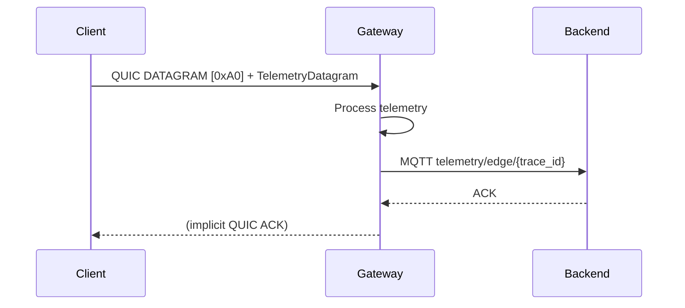

# AXCP v0.3-edge-beta – Adaptive eXchange Context Protocol

© 2025 TradePhantom LLC – BSL 1.1 / Apache-2.0 fallback

_Work in progress – structure auto-generated._

> This document defines the initial AXCP protocol specification.
> Version: **0.3-edge-beta**
> Status: **Draft**
> Last updated: 2025-05-30

---

## Table of Contents

- [1. Preface](#1-preface)
- [2. Overview](#2-overview)
- [3. Protocol Basics](#3-protocol-basics)
- [4. Message Types](#4-message-types)
- [5. Transport Layer](#5-transport-layer)
- [6. Differential Privacy (Enterprise)](#6-differential-privacy-enterprise)
- [7. Security Considerations](#7-security-considerations)
- [8. Error Handling](#8-error-handling)
- [9. Extensibility](#9-extensibility)
- [Appendix A – Example Flows](#appendix-a-example-flows)
- [Appendix B – Interop Profiles](#appendix-b-interop-profiles)
- [Appendix C – Telemetry Datagram Format](#appendix-c-telemetry-datagram-format)

## 5. Transport Layer

### 5.8 QUIC DATAGRAM Extension

AXCP extends QUIC with a DATAGRAM frame for low-latency telemetry data. This is particularly useful for real-time monitoring and metrics collection in edge computing scenarios.

#### 5.8.1 Telemetry Datagram Format

A QUIC DATAGRAM with first byte `0xA0` MUST carry a `TelemetryDatagram` protobuf message:

```protobuf
message TelemetryDatagram {
  // Timestamp in milliseconds since epoch
  int64 timestamp_ms = 1;
  
  // Trace ID for correlating telemetry data
  string trace_id = 2;
  
  // Privacy profile level (0-5, higher means more privacy)
  uint32 profile = 3;
  
  // Telemetry payload (oneof allows for future extensibility)
  oneof payload {
    SystemStats system = 10;
    NetworkStats network = 11;
    // Future: GPU stats, custom metrics, etc.
  }
}

message SystemStats {
  // CPU usage percentage (0-100)
  uint32 cpu_percent = 1;
  
  // Memory usage in bytes
  uint64 mem_bytes = 2;
  
  // Number of goroutines/threads
  uint32 num_goroutines = 3;
  
  // Uptime in seconds
  uint64 uptime_sec = 4;
}

message NetworkStats {
  // Bytes received
  uint64 rx_bytes = 1;
  
  // Bytes transmitted
  uint64 tx_bytes = 2;
  
  // Packets received
  uint64 rx_packets = 3;
  
  // Packets transmitted
  uint64 tx_packets = 4;
  
  // Connection count
  uint32 conn_count = 5;
}
```

#### 5.8.2 Processing Rules

1. **Datagram Identification**:
   - The first byte of the DATAGRAM frame MUST be `0xA0` to identify it as a telemetry datagram.
   - The remaining bytes MUST be a valid `TelemetryDatagram` protobuf message.

2. **Privacy Considerations**:
   - Privacy features (differential privacy noise, budget management) are available in AXCP Enterprise Edition.
   - See Enterprise documentation for details on privacy-enhanced telemetry processing.

3. **Error Handling**:
   - Malformed datagrams MUST be silently dropped.
   - Unknown telemetry types SHOULD be logged but not cause connection termination.

4. **Forwarding**:
   - Gateways SHOULD forward valid telemetry datagrams to configured endpoints (e.g., MQTT topics).
   - The `trace_id` field SHOULD be used for routing and correlation.

5. **Rate Limiting**:
   - Implementations SHOULD enforce rate limiting to prevent abuse.
   - Recommended default: 10 datagrams/second per connection.

#### 5.8.3 Example Flow


```mermaid
sequenceDiagram
    participant C as Client
    participant G as Gateway
    participant B as Backend
    
    C->>G: QUIC DATAGRAM [0xA0] + TelemetryDatagram
    G->>G: Process telemetry
    G->>B: MQTT telemetry/edge/{trace_id}
    B-->>G: ACK
    G-->>C: (implicit QUIC ACK)
```

#### 5.8.4 Security Considerations

- **Authentication**: The QUIC connection MUST be authenticated using TLS 1.3.
- **Authorization**: Implementations SHOULD verify that clients are authorized to send telemetry data.
- **Privacy**: Privacy-enhanced features are available in AXCP Enterprise Edition.
- **Integrity**: The QUIC connection provides integrity protection for datagrams.

### 5.9 Differential Privacy Integration (Enterprise)

> **Enterprise Feature:** Differential Privacy (DP) capabilities including noise mechanisms,
> privacy budget management, and parameter negotiation are available in the AXCP Enterprise Edition.
> See the [Enterprise documentation](../enterprise/README.md) for implementation details.
